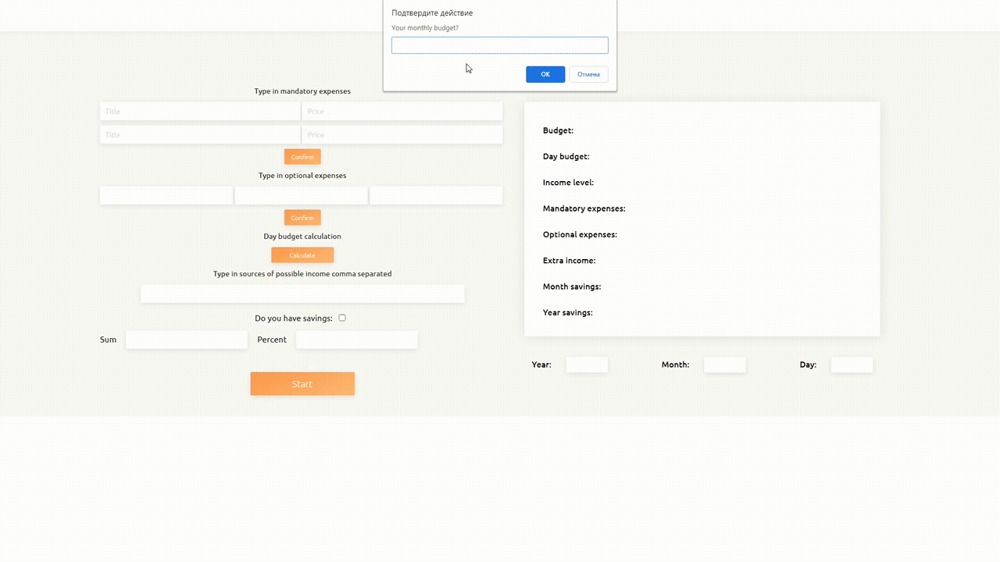

# Budget 
> Personal finance calctulation app
> 
<a href="https://username1111111111.github.io/Budget/">Live demo here</a>

> 
Or 👇:

## Table of Contents
* [General Info](#general-information)
* [Technologies Used](#technologies-used)
* [Features](#features)
* [Screenshots](#screenshots)
* [Usage](#usage)
* [Contact](#contact)

## General Information
- This was done as one of my Udemy learning projects
- It was inteded for practice with DOM events, DOM manipulation, date parsing, data parsing from forms, window prompt.

## Technologies Used
- Just pure vanila JS 🤷‍♂️

## Features
- Calculates income level
- Calculates budget per day
- Calculates investment per year
- Parses Date and Forms internals

## Screenshots

## Usage
Just clone the repo and open **index.html** in a browser 👍

## Contact

<a style="text-decoration: none;"href="https://github.com/Username1111111111/Username1111111111">@Username1111111111</a>
 
  
The Frontend developer

  💪

